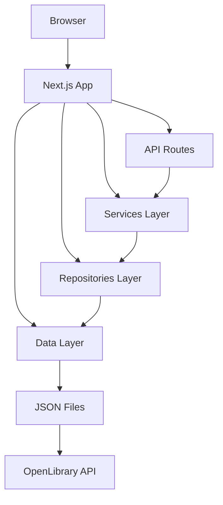
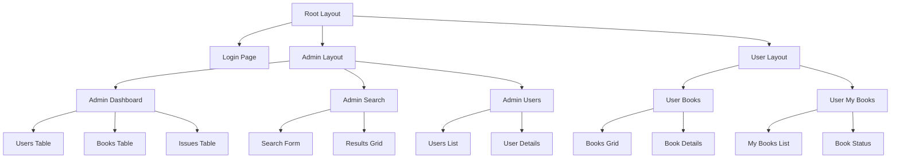

# Library Management System - Flow Chart

## Overview
This document provides a comprehensive flow chart of the Library Management System, a Next.js application for managing library operations including user authentication, book management, and borrowing records.

## System Architecture



## User Authentication Flow

```mermaid
flowchart TD
    A[User] --> B[Login Page]
    B --> C[POST /api/auth/login]
    C --> D[UserService.getUserByEmail]
    D --> E[UserRepository.findByEmail]
    E --> F[JSON File]
    F --> G[Return User Data]
    G --> H[Store in localStorage]
    H --> I[Redirect to Role Page]
    
    I --> J[/admin for ADMIN]
    I --> K[/user for USER]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
<!-- @import "[TOC]" {cmd="toc" depthFrom=1 depthTo=6 orderedList=false} -->

```

## Admin Dashboard Flow

```mermaid
flowchart TD
    A[Admin] --> B[/admin Dashboard]
    B --> C[UserService.getAllUsers]
    C --> D[UserRepository.findAll]
    D --> E[JSON File]
    
    B --> F[BookService.getAll]
    F --> G[BookRepository.findAll]
    G --> H[JSON File]
    
    B --> I[IssueService.getAllIssues]
    I --> J[IssueRepository.findAll]
    J --> K[JSON File]
```

## Book Search & Add Flow

```mermaid
flowchart TD
    A[Admin] --> B[/admin/search]
    B --> C[OpenLibraryService.searchBooks]
    C --> D[OpenLibrary API]
    D --> E[Return Search Results]
    
    B --> F[BookService.create]
    F --> G[BookRepository.create]
    G --> H[JSON File]
```

## User Book Borrowing Flow

```mermaid
flowchart TD
    A[Student] --> B[/user/books]
    B --> C[BookService.searchLocal]
    C --> D[BookRepository.search]
    D --> E[JSON File]
    
    A --> F[/user/my-books]
    F --> G[IssueService.getUserIssues]
    G --> H[IssueRepository.findByUserId]
    H --> I[JSON File]
    
    B --> J[IssueService.issueBook]
    J --> K[BookRepository.update]
    K --> L[JSON File]
    J --> M[IssueRepository.create]
    M --> N[JSON File]
```

## Data Layer Structure

```mermaid
graph TB
    subgraph "Data Layer"
        A[users.json]
        B[books.json]
        C[issues.json]
    end
    
    subgraph "Repositories"
        D[UserRepository]
        E[BookRepository]
        F[IssueRepository]
    end
    
    subgraph "Services"
        G[UserService]
        H[BookService]
        I[IssueService]
        J[OpenLibraryService]
    end
    
    subgraph "API Routes"
        K[/api/users]
        L[/api/books]
        M[/api/issues]
        N[/api/auth/login]
    end
    
    A --> D
    B --> E
    C --> F
    
    D --> G
    E --> H
    F --> I
    
    G --> K
    H --> L
    I --> M
    J --> L
    
    K --> N
```

## Component Hierarchy



## API Endpoints

```mermaid
flowchart TD
    A[API Routes] --> B[/api/auth/login]
    A --> C[/api/users]
    A --> D[/api/users/[id]]
    A --> E[/api/books]
    A --> F[/api/books/[id]]
    A --> G[/api/issues]
    A --> H[/api/issues/[id]]
    
    B --> I[POST - Login]
    C --> J[GET - All Users]
    D --> K[GET/PUT/DELETE - User]
    E --> L[GET/POST - Books]
    F --> M[GET/PUT/DELETE - Book]
    G --> N[GET/POST - Issues]
    H --> O[GET/PUT/DELETE - Issue]
```

## Data Flow Summary

1. **Authentication**: User logs in via `/api/auth/login` → `UserService` → `UserRepository` → JSON data
2. **Book Management**: Admin searches via `OpenLibraryService` → `BookService` → `BookRepository` → JSON data
3. **Borrowing**: User borrows via `IssueService` → `BookRepository` (update stock) → `IssueRepository` → JSON data
4. **User Management**: Admin views users via `UserService` → `UserRepository` → JSON data

## Technology Stack

- **Frontend**: Next.js 16.1.6, React 19.2.3, TypeScript
- **Styling**: Tailwind CSS
- **Backend**: Next.js API Routes
- **Data Storage**: JSON files
- **External API**: OpenLibrary.org for book data
- **Authentication**: Simple email-based login with localStorage

## Key Features

- Role-based access control (Admin/Student)
- Multi-location book inventory management
- Book borrowing with due dates and overdue tracking
- Search functionality using OpenLibrary API
- Real-time data updates across components
- Responsive design with modern UI

This flow chart represents the complete data flow and architecture of the Library Management System.